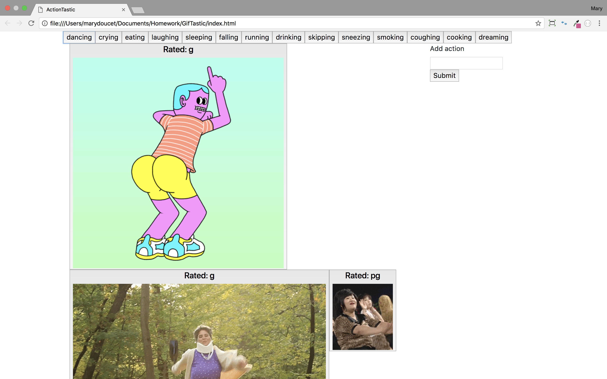
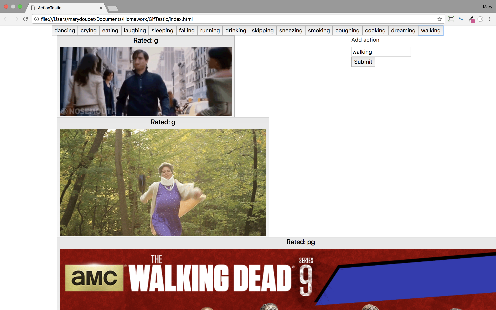

# GifTastic
Implements the Giphy API. Displays actions pertaining to button clicked. Gifs animate when mouse hovers over image. Allows user input to create new action buttons.

## Screen Shot

Clicking on action displays gifs relating to that action.


User can input new action and when button is clicked, creates gifs of that action.

## Technologies used
- Bootstrap
- jQuery
- Giphy API

### Prerequisites

```
- Bootstrap: visit http://getbootstrap.com/getting-started/ for the CDN and link in html
- jQuery: visit http://code.jquery.com/ and link in html
- Giphy API: find documentation here: https://github.com/Giphy/GiphyAPI
```

## Built With

* Sublime Text - Text Editor
* Bootstrap- Wireframe

## Authors

* **Mary Doucet** - *HTML/CSS/JS* - [Mary Doucet](https://github.com/medoucet720)
